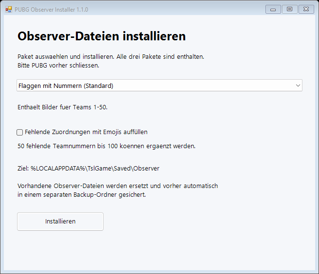
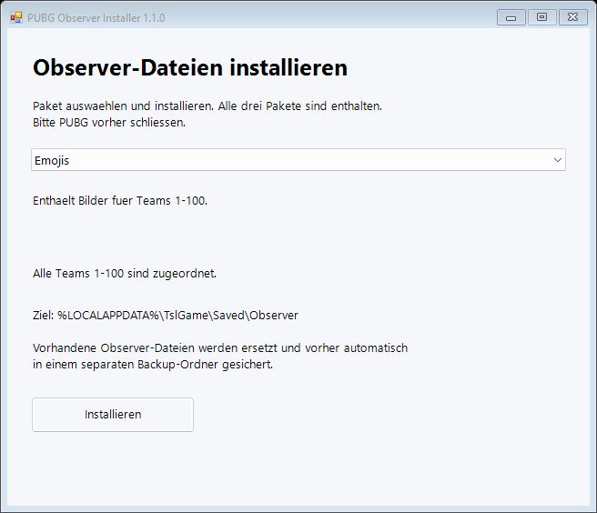
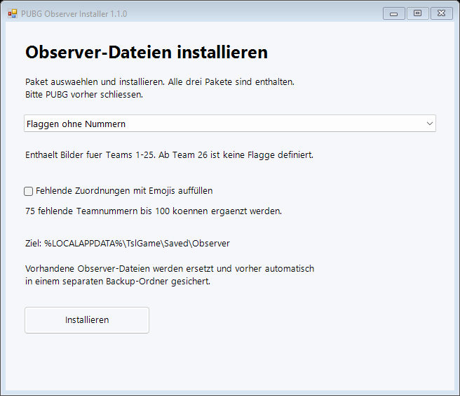

# PUBG Observer Installer

Observer-Dateien fuer PUBG mit wenigen Klicks installieren: Paket waehlen, **Installieren** anklicken, PUBG starten.

**[Windows-Installer herunterladen](https://github.com/FloErwerth/pubg-observerfiles/releases/latest/download/PUBG-Observer-Installer.exe)** · [Alle Releases](https://github.com/FloErwerth/pubg-observerfiles/releases) · [Problem melden](https://github.com/FloErwerth/pubg-observerfiles/issues)



## Enthaltene Pakete

| Auswahl | Inhalt |
| --- | --- |
| **Flaggen mit Nummern (Standard)** | 50 Team-Icons |
| Emojis | 100 Team-Icons |
| Flaggen ohne Nummern | 25 Team-Icons, Teams 1-25 |
| Eigener Observer-Ordner | Eigenes Paket mit TeamInfo.csv und TeamIcon |

Alle drei Pakete sind direkt in der EXE enthalten. Es ist kein Internetzugang und kein Google-Drive-Login erforderlich.

<details>
<summary>Weitere Ansichten</summary>




</details>

## Installation

1. Die EXE aus den [Releases](https://github.com/FloErwerth/pubg-observerfiles/releases/latest) herunterladen. Die Source-Code-Archive sind fuer Entwickler.
2. PUBG schliessen.
3. `PUBG-Observer-Installer.exe` mit deinem normalen Windows-Benutzerkonto starten.
4. Das gewuenschte Paket auswaehlen. **Flaggen mit Nummern** ist vorausgewaehlt.
5. Optional **Fehlende Zuordnungen mit Emojis auffuellen** aktivieren, um fehlende Teams bis 100 zu ergaenzen.
6. **Installieren** anklicken und auf die Erfolgsmeldung warten. Danach PUBG starten.

Das Ziel ist `%LOCALAPPDATA%\TslGame\Saved\Observer`. Administratorrechte sind nicht erforderlich.

## Fehlende Zuordnungen mit Emojis auffuellen

Die Checkbox erscheint, wenn die ausgewaehlte CSV nicht alle Teamnummern 1 bis 100 enthaelt. Sie ist standardmaessig ausgeschaltet und wird beim Wechsel des Pakets zurueckgesetzt. Die Pruefung funktioniert auch bei einem eigenen Observer-Ordner.

- Flaggen mit Nummern: optional Emojis fuer Teams 51-100.
- Flaggen ohne Nummern: optional Emojis fuer Teams 26-100.
- Emojis: bereits vollstaendig, deshalb keine Checkbox.
- Eigene CSV: auch Luecken mitten in der Teamnummernfolge werden ergaenzt.

Vorhandene Teamnamen, Bildzuordnungen und Bilder bleiben erhalten. Ergaenzt wird jeweils das Emoji derselben Teamnummer aus dem enthaltenen Emoji-Paket. Neue Bilder erhalten eigene Dateinamen, sodass vorhandene Dateien nicht ueberschrieben werden. Es wird ausschliesslich die Installationskopie bearbeitet, nicht der ausgewaehlte Quellordner. Ein vorhandener CSV-Eintrag mit fehlendem Bild wird durch diese Option nicht ersetzt.

Eigene CSV-Dateien muessen kommasepariert sein und eindeutige Teamnummern sowie die Spalten `TeamNumber` und `ImageFileName` enthalten. Anfuehrungszeichen in CSV-Feldern werden unterstuetzt. Fuer die CSV-Pruefung werden UTF-8 sowie BOM-markierte Unicode-Dateien unterstuetzt. Fehler beim Auffuellen lassen eine bisherige Installation unveraendert.

## Voraussetzungen

Windows mit .NET Framework **4.5 oder neuer**. Windows 10/11 sind die vorgesehenen Zielplattformen; es wurde keine umfassende Betriebssystem-Testmatrix durchgefuehrt.

Die EXE ist **nicht digital signiert**. Windows kann einen unbekannten Herausgeber melden. `SHA256SUMS.txt` im Release enthaelt die Pruefsumme. Zum Vergleichen in PowerShell:

```powershell
Get-FileHash .\PUBG-Observer-Installer.exe -Algorithm SHA256
```

## Sicherung und Rueckgaengigmachen

Ein vorhandener `Observer`-Ordner wird vor dem Ersetzen als `Observer-backup-DATUM-ID` im gleichen Verzeichnis gesichert. Das neue Paket wird zuvor vollstaendig in einen Zwischenordner kopiert. Ein Paketwechsel ersetzt den gesamten Observer-Ordner.

Zum Wiederherstellen PUBG und Installer schliessen, unter `%LOCALAPPDATA%\TslGame\Saved` den aktuellen `Observer`-Ordner umbenennen und die gewuenschte Sicherung wieder `Observer` nennen. Ohne vorherige Installation kann der neu angelegte Observer-Ordner nach Schliessen des Spiels entfernt werden.

Backups werden nicht automatisch geloescht. Nach einem Kopierfehler kann ein `Observer-staging-*`-Ordner zur manuellen Bereinigung verbleiben. Verknuepfte Quell- oder Zielordner werden abgelehnt.

## Entwicklung

In Windows PowerShell oder PowerShell 7:

```powershell
.\build.ps1
.\tests\smoke.ps1
.\scripts\render-ui.ps1
```

Der Build nutzt den .NET-Framework-Compiler von Windows. Die Ausgabe liegt unter `dist/`; nur EXE und `SHA256SUMS.txt` werden fuer den Release benoetigt. Die ZIP-Dateien sind Zwischenprodukte. `-OutputDirectory` erlaubt einen separaten Build-Ordner, falls eine bereits gestartete EXE die Standardausgabe sperrt. Test- und Render-Skript akzeptieren dazu `-InstallerPath`.

Die Tests pruefen Erstinstallation, Backup, Ersetzung, ungueltige Quellen, die SHA-256-Werte aller 178 Paketdateien, Teamnummern und Bildverweise sowie die vorausgewaehlte Auswahl. Alle Installationen erfolgen dabei in separaten temporaeren Testordnern. Ein Funktionstest innerhalb von PUBG steht aus. Die Ansichten werden direkt aus der Windows-Forms-Oberflaeche gerendert.

## Teams ausserhalb des Pakets

Die Zuordnung erfolgt ueber `TeamNumber` in der CSV. Das Paket ohne Nummern definiert Teams 1-25, die nummerierten Flaggen Teams 1-50 und Emojis Teams 1-100. Fuer weitere Teamnummern ist darin kein eigenes Bild hinterlegt. Team 24 (Italien) und Team 25 (Niederlande) wurden fuer dieses Projekt ergaenzt; ihre PNGs lassen sich mit `scripts/generate-extra-flags.ps1` erneut erzeugen.

PUBG dokumentiert die normalen Teamnummern im Killfeed in den [Patch Notes 26.1](https://pubg.com/en/news/6717?category=patch_notes). Ein Rueckfall auf diese Standardanzeige bei nicht definierten Teams ist plausibel, wurde aber fuer die aktuelle Spielversion nicht im Spiel verifiziert und ist in den gefundenen Quellen nicht ausdruecklich beschrieben. Ein fehlender CSV-Eintrag und ein CSV-Verweis auf eine fehlende Bilddatei sind unterschiedliche Faelle; Letzteres wird in den enthaltenen Paketen durch die Tests ausgeschlossen.

## Lizenz und Quellen

Der Installer-Code steht unter der [MIT-Lizenz](LICENSE). Diese gilt **nicht** fuer die eingebetteten Observer-Pakete: deren Herkunft und Weitergaberechte sind nicht belegt. Details stehen in den [Quellen- und Lizenzhinweisen](THIRD_PARTY_NOTICES.md).

Referenz fuer die Ordnerstruktur: [suit/pubg-killfeed-flags](https://github.com/suit/pubg-killfeed-flags#install). Dies ist keine bestaetigte Quelle der enthaltenen Dateien.

Unabhaengiges Community-Projekt, nicht mit KRAFTON verbunden.
