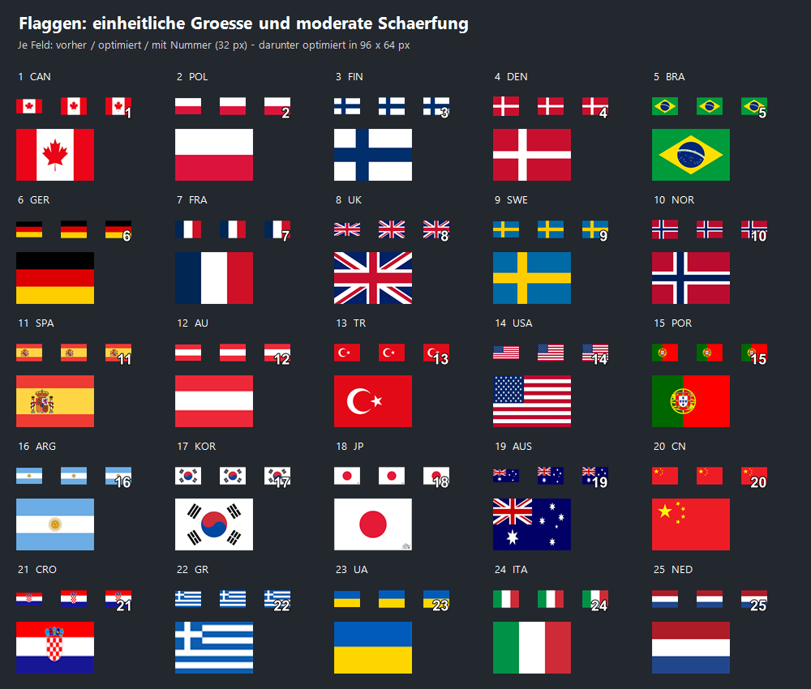
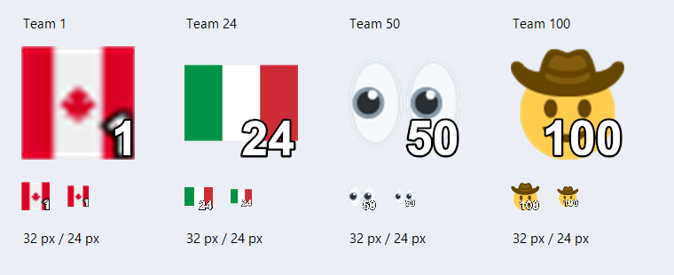
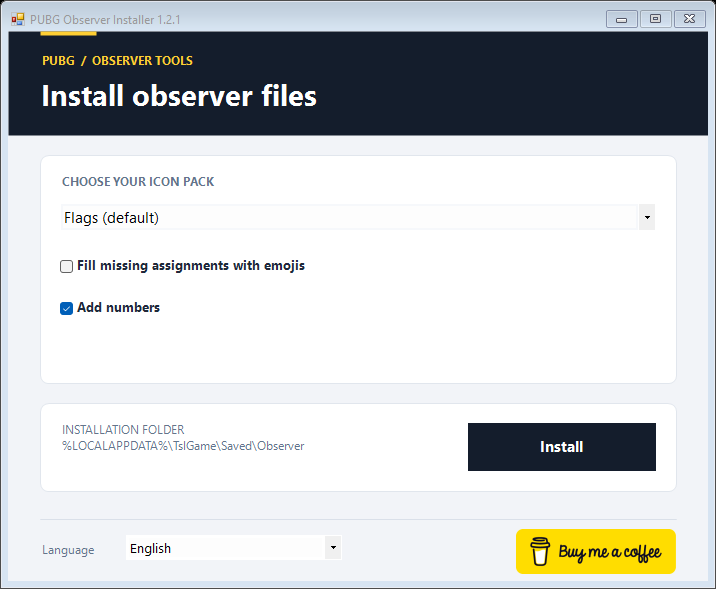

# PUBG Observer Installer

Observer-Dateien für PUBG mit wenigen Klicks installieren: Paket wählen, **Installieren** anklicken, PUBG starten.

**[Windows-Installer herunterladen](https://github.com/FloErwerth/pubg-observerfiles/releases/latest/download/PUBG-Observer-Installer.exe)** · [Alle Releases](https://github.com/FloErwerth/pubg-observerfiles/releases) · [Problem melden](https://github.com/FloErwerth/pubg-observerfiles/issues)


## Enthaltene Pakete

| Auswahl | Inhalt |
| --- | --- |
| **Flaggen (Standard)** | 25 Team-Icons, Teams 1-25 |
| Emojis | 100 Team-Icons |
| Eigener Observer-Ordner | Eigenes Paket mit TeamInfo.csv und TeamIcon |

Beide Pakete sind direkt in der EXE enthalten. Nummern werden über die standardmäßig aktive Option hinzugefügt; ein separates Paket mit fest eingebrannten Nummern ist nicht mehr enthalten. Es ist kein Internetzugang und kein Google-Drive-Login erforderlich.

Ab Version 1.2.2 haben alle 25 Flaggen eine einheitliche Fläche von **192 × 128 Pixeln (3:2)**. Dafür werden ihre ursprünglichen Seitenverhältnisse angeglichen, ohne Motive abzuschneiden. Hochwertige Skalierung und moderate Nachschärfung verbessern die Darstellung; fehlende Details kleiner Quelldateien lassen sich dadurch nicht wiederherstellen. Die Originale liegen unter `assets/flags-source`.



<details>
<summary>Weitere Ansichten</summary>


</details>

## Installation

1. Die EXE aus den [Releases](https://github.com/FloErwerth/pubg-observerfiles/releases/latest) herunterladen. Die Source-Code-Archive sind für Entwickler.
2. PUBG schließen.
3. `PUBG-Observer-Installer.exe` mit deinem normalen Windows-Benutzerkonto starten.
4. Das gewünschte Paket auswählen. **Flaggen** ist vorausgewählt, die Nummerierungsoption ist aktiv.
5. Optional **Fehlende Zuordnungen mit Emojis auffüllen** aktivieren, um fehlende Teams bis 100 zu ergänzen.
6. **Installieren** anklicken und auf die Erfolgsmeldung warten. Danach PUBG starten.

Das Ziel ist `%LOCALAPPDATA%\TslGame\Saved\Observer`. Administratorrechte sind nicht erforderlich.

## Gut lesbare Teamnummern

Die Option **Nummern hinzufügen** ist standardmäßig aktiv und kann für alle Pakete sowie eigene Observer-Ordner ausgeschaltet werden. Jedes in der CSV zugeordnete Bild erhält unten rechts seine Teamnummer in weißer, kräftiger Schrift mit schwarzer Kontur, ohne zusätzliche Hintergrundfläche. Dafür werden eigene PNG-Dateien mit 128 × 128 Pixeln erzeugt; die Originalbilder bleiben erhalten. Das Seitenverhältnis des Motivs bleibt bestehen.

Die Nummerierung wird nach der optionalen Emoji-Ergänzung angewendet, sodass auch aufgefüllte Teams ihre passende Zahl bekommen. Beim Ausschalten und erneuten Installieren eines enthaltenen Pakets werden wieder dessen Originalbilder verwendet. Bereits in Originalbildern enthaltene Nummern werden dadurch nicht entfernt.

Ab Version 1.2.3 sind die Zahlen etwa 20 Prozent größer; dreistellige Teamnummern erhalten entsprechend mehr Platz in der Breite.



Die Vorschau prüft die Lesbarkeit bei kleinen Bildgrößen; die konkrete Skalierung im aktuellen PUBG-Client wurde noch nicht im Spiel getestet.

## Fehlende Zuordnungen mit Emojis auffüllen

Die Checkbox erscheint, wenn die ausgewählte CSV nicht alle Teamnummern 1 bis 100 enthält. Sie ist standardmäßig ausgeschaltet und wird beim Wechsel des Pakets zurückgesetzt. Die Prüfung funktioniert auch bei einem eigenen Observer-Ordner.

- Flaggen: optional Emojis für Teams 26-100.
- Emojis: bereits vollständig, deshalb keine Checkbox.
- Eigene CSV: auch Lücken mitten in der Teamnummernfolge werden ergänzt.

Das Emoji-Paket liefert seit Version 1.2.3 für jedes Team einen vollständigen RGBA-Farbwert (`ffffffff`). Dadurch enden ergänzte CSV-Zeilen nicht mehr mit einem leeren `TeamColor`-Feld. Dies adressiert eine mögliche Ursache für nicht angezeigte Ergänzungen wie Team 26; die Bestätigung im Spiel steht aus.

Vorhandene Teamnamen, Bildzuordnungen und Bilder bleiben erhalten. Ergänzt wird jeweils das Emoji derselben Teamnummer aus dem enthaltenen Emoji-Paket. Neue Bilder erhalten eigene Dateinamen, sodass vorhandene Dateien nicht überschrieben werden. Es wird ausschliesslich die Installationskopie bearbeitet, nicht der ausgewählte Quellordner. Ein vorhandener CSV-Eintrag mit fehlendem Bild wird durch diese Option nicht ersetzt.

Eigene CSV-Dateien muessen kommasepariert sein und eindeutige Teamnummern sowie die Spalten `TeamNumber` und `ImageFileName` enthalten. Anführungszeichen in CSV-Feldern werden unterstützt. Fuer die CSV-Prüfung werden UTF-8 sowie BOM-markierte Unicode-Dateien unterstützt. Fehler beim Auffuellen lassen eine bisherige Installation unverändert.

Seit Version 1.2.2 bleiben Spaltennamen und einfache CSV-Werte auch bei Nummerierung und Emoji-Ergänzung ohne Anführungszeichen. Die vorherige Ausgabe setzte sämtliche Felder in Anführungszeichen und steht im Zusammenhang mit dem gemeldeten Ladefehler. Eigene Werte mit Kommas, Anführungszeichen oder Zeilenumbrüchen werden weiterhin korrekt als CSV maskiert; deren Unterstützung durch PUBG wurde nicht bestätigt.

## Sprache und Unterstützung

Der Installer startet mit der Windows-Anzeigesprache. Deutsch wird für deutsche Systeme verwendet, Englisch für englische und andere nicht unterstützte Systemsprachen. Über **Sprache / Language** kannst du jederzeit **Systemsprache**, **English** oder **Deutsch** auswählen. Deutsche Texte enthalten echte Umlaute. Die Paketauswahl und die Emoji-Option bleiben beim Sprachwechsel erhalten.

Der offizielle **Buy Me a Coffee**-Button öffnet [buymeacoffee.com/forli69](https://buymeacoffee.com/forli69) im Standardbrowser. Eine Unterstützung ist freiwillig und für keine Funktion erforderlich.

<a href="https://buymeacoffee.com/forli69"></a>



## Voraussetzungen

Windows mit .NET Framework **4.5 oder neuer**. Windows 10/11 sind die vorgesehenen Zielplattformen; es wurde keine umfassende Betriebssystem-Testmatrix durchgefuehrt.

Die EXE ist **nicht digital signiert**. Windows kann einen unbekannten Herausgeber melden. `SHA256SUMS.txt` im Release enthält die Prüfsumme. Zum Vergleichen in PowerShell:

```powershell
Get-FileHash .\PUBG-Observer-Installer.exe -Algorithm SHA256
```

## Sicherung und Rückgängigmachen

Ab Version 1.2.4 liegen Sicherungen und Zwischenordner unter `%LOCALAPPDATA%\PUBG Observer Installer\<Zielkennung>`, außerhalb von `TslGame`. Ein vorhandener `Observer`-Ordner wird dort als `Observer-backup-DATUM-ID` gesichert. Das neue Paket wird zuvor vollständig in einem externen Zwischenordner vorbereitet. Ein Paketwechsel ersetzt den gesamten Observer-Ordner. Der genaue Sicherungspfad erscheint nach der Installation.

Zum Wiederherstellen PUBG und Installer schließen und im Installer die gewünschte Sicherung als eigenen Observer-Ordner auswählen. Nummerierung und Emoji-Ergänzung ausschalten, um die gesicherten Inhalte wieder zu übernehmen. Die bisherige Installation wird dabei ebenfalls extern gesichert.

Backups werden nicht automatisch gelöscht. Alte `Observer-backup-*`- und `Observer-staging-*`-Ordner im bisherigen Namensformat werden bei der nächsten Installation nach außen verschoben. Die beiden Sicherungsdateien des Team-29-Testskripts liegen dort unter `diagnostics`; frühere Dateien im aktiven Observer-Ordner werden ebenfalls ausgelagert. Nach einem Kopierfehler kann ein externer Zwischenordner verbleiben, dessen Pfad die Fehlermeldung nennt. Verknüpfte Quell-, Ziel- oder Speicherordner werden abgelehnt. Ziel und Sicherungsablage müssen auf demselben Laufwerk liegen, damit Austausch und Rücknahme per Umbenennung erfolgen können; das gilt für das normale PUBG-Ziel automatisch.

## Entwicklung

In Windows PowerShell oder PowerShell 7:

```powershell
.\build.ps1
.\tests\smoke.ps1
.\tests\observer-compatibility.ps1
.\scripts\render-ui.ps1
```

Die Flaggen lassen sich mit `scripts/optimize-flags.ps1` erneut aus den Originalen erzeugen. Danach neu bauen; `scripts/preview-flags.ps1 -InstallerPath <EXE>` erzeugt die Vergleichsansicht einschließlich nummerierter Icons bei 32 Pixeln.

Der Build nutzt den .NET-Framework-Compiler von Windows. Die Ausgabe liegt unter `dist/`; nur EXE und `SHA256SUMS.txt` werden für den Release benötigt. Die ZIP-Dateien sind Zwischenprodukte. `-OutputDirectory` erlaubt einen separaten Build-Ordner, falls eine bereits gestartete EXE die Standardausgabe sperrt. Test- und Render-Skript akzeptieren dazu `-InstallerPath`.

Die Tests prüfen Erstinstallation, Backup, Ersetzung, ungueltige Quellen, die SHA-256-Werte aller 127 Paketdateien, Teamnummern und Bildverweise sowie die vorausgewählte Auswahl. Alle Installationen erfolgen dabei in separaten temporaeren Testordnern. Ein Funktionstest innerhalb von PUBG steht aus. Die Ansichten werden direkt aus der Windows-Forms-Oberflaeche gerendert.

## Teams außerhalb des Pakets

Die Zuordnung erfolgt über `TeamNumber` in der CSV. Flaggen definiert Teams 1-25 und Emojis Teams 1-100. Für weitere Teamnummern ist ohne Emoji-Ergänzung kein eigenes Bild hinterlegt. Team 24 (Italien) und Team 25 (Niederlande) wurden für dieses Projekt ergänzt; ihre PNGs lassen sich mit `scripts/generate-extra-flags.ps1` erneut erzeugen.

PUBG dokumentiert die normalen Teamnummern im Killfeed in den [Patch Notes 26.1](https://pubg.com/en/news/6717?category=patch_notes). Ein Rückfall auf diese Standardanzeige bei nicht definierten Teams ist plausibel, wurde aber für die aktuelle Spielversion nicht im Spiel verifiziert und ist in den gefundenen Quellen nicht ausdrücklich beschrieben. Ein fehlender CSV-Eintrag und ein CSV-Verweis auf eine fehlende Bilddatei sind unterschiedliche Faelle; Letzteres wird in den enthaltenen Paketen durch die Tests ausgeschlossen.

## Lizenz und Quellen

Der Installer-Code steht unter der [MIT-Lizenz](LICENSE). Diese gilt **nicht** für die eingebetteten Observer-Pakete: deren Herkunft und Weitergaberechte sind nicht belegt. Details stehen in den [Quellen- und Lizenzhinweisen](THIRD_PARTY_NOTICES.md).

Referenz für die Ordnerstruktur: [suit/pubg-killfeed-flags](https://github.com/suit/pubg-killfeed-flags#install). Dies ist keine bestätigte Quelle der enthaltenen Dateien.

Unabhaengiges Community-Projekt, nicht mit KRAFTON verbunden.
